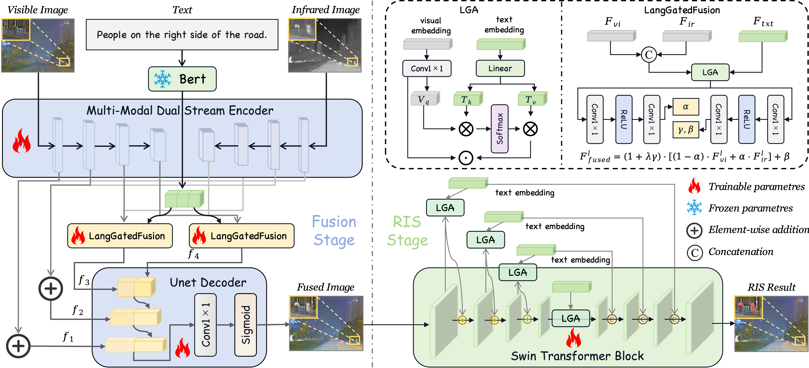

# RIS-FUSION: Rethinking Text-Driven Infrared and Visible Image Fusion from the Perspective of Referring Image Segmentation

**Siju Ma<sup>1</sup>, Changsiyu Gong<sup>1</sup>, Xiaofeng Fan<sup>1</sup>, Yong Ma<sup>1</sup>, Chengjie Jiang<sup>2*</sup>**

<sup>1</sup> Central University of Finance and Economics, Beijing, China  
<sup>2</sup> Tsinghua University, Shenzhen, China  
\*Corresponding Author





---

## 📖 Introduction

Text-driven infrared and visible image fusion has gained attention for enabling natural language to guide the fusion process. However, existing methods lack a goal-aligned task to supervise and evaluate how effectively the input text contributes to the fusion outcome.  

We observe that **referring image segmentation (RIS)** and text-driven fusion share a common objective: highlighting the object referred to by the text. Motivated by this, we propose **RIS-FUSION**, a cascaded framework that unifies fusion and RIS through joint optimization.  

At its core is the *LangGatedFusion* module, which injects textual features into the fusion backbone to enhance semantic alignment. To support the multimodal referring image segmentation task, we introduce *MM-RIS*, a large-scale benchmark with **12.5k training** and **3.5k testing** triplets, each consisting of an infrared-visible image pair, a segmentation mask, and a referring expression.  

Extensive experiments show that **RIS-FUSION** achieves state-of-the-art performance, outperforming existing methods by **over 11% in mIoU**.


---

## ⚙️ Installation

### 1. Clone the repository
```bash
git clone https://github.com/SijuMa2003/RIS-FUSION
cd RIS-FUSION
```

### 2. Setup Python environment
We recommend using **Conda**:
```bash
conda create -n risfusion python=3.10 -y
conda activate risfusion
```

### 3. Install PyTorch
```bash
pip install torch==2.1.0 torchvision==0.16.0
```
👉 If you are using **Ascend NPU**, please additionally install:
```bash
pip install torch_npu-2.1.0  # from vendor-provided wheel
```

### 4. Install other dependencies
```bash
pip install -r requirements.txt
```

---

## 📥 Data & Pretrained Weights

1. **BERT weights**  
   Download instructions are in:  
   ```
   ./bert/pretrained_weights/download_weights.txt
   ```

2. **Dataset (MM-RIS)**  
  The dataset is available at: [MM-RIS on Hugging Face](https://huggingface.co/datasets/ronniejiangC/MM-RIS)  

    It contains four files:  
    - `mm_ris_test.parquet`  
    - `mm_ris_val.parquet`  
    - `mm_ris_train_part1.parquet`  
    - `mm_ris_train_part2.parquet`  

     Download all files and place them under:

    - Place the files under:
      ```
      ./data/
      ```
    - Merge partitioned parquet files into a full training set:
      ```bash
      python ./data/merge_parquet.py
      ```

3. **Pretrained weights**  
    Instructions are provided in:
    ```
    ./pretrained_weights/pretrained_weights.txt
    ```
    Includes pretrained **Swin Transformer** and **LAVT** weights.

      Additionally, you can directly download the trained **RIS-FUSION model weights**:
      ```bash
      wget https://huggingface.co/ronniejiangC/RIS-FUSION/resolve/main/model_best_lavt.pth -P ./ckpts/risfusion/
      ```


---

## 🚀 Training

Example command for training:

```bash
python train_with_lavt.py      
  --train_parquet ./data/mm_ris_train.parquet    
  --val_parquet   ./data/mm_ris_val.parquet     
  --prefusion_model unet_fuser --prefusion_base_ch 32     
  --epochs 10 -b 16 -j 16     
  --img_size 480     
  --swin_type base 
  --pretrained_swin_weights ./pretrained_weights/swin_base_patch4_window12_384_22k.pth     
  --bert_tokenizer ./bert/pretrained_weights/bert-base-uncased 
  --ck_bert ./bert/pretrained_weights/bert-base-uncased     
  --init_from_lavt_one ./pretrained_weights/lavt_one_8_cards_ImgNet22KPre_swin-base-window12_refcoco+_adamw_b32lr0.00005wd1e-2_E40.pth     
  --lr_seg 5e-5 --wd_seg 1e-2 --lr_pf 1e-4 --wd_pf 1e-2     
  --lambda_prefusion 3.0     
  --w_sobel_vis 0.0 
  --w_sobel_ir 1.0     
  --w_grad 1.0     
  --w_ssim_vis 0.5 
  --w_ssim_ir 0.0     
  --w_mse_vis 0.5 
  --w_mse_ir 2.0     
  --eval_vis_dir ./eval_vis 
  --output-dir ./ckpts/risfusion
```

---

## 🧪 Testing

Example command for evaluation:

```bash
python test.py   
  --ckpt  ./ckpts/risfusion/model_best_lavt.pth   
  --test_parquet ./data/mm_ris_test.parquet   
  --out_dir ./your_output_dir  
  --bert_tokenizer ./bert/pretrained_weights/bert-base-uncased   
  --ck_bert ./bert/pretrained_weights/bert-base-uncased
```

---

## 📌 Citation
If you find this repository useful, please consider citing our paper:

```bibtex
@article{RIS-FUSION2025,
  title   = {RIS-FUSION: Rethinking Text-Driven Infrared and Visible Image Fusion from the Perspective of Referring Image Segmentation},
  author  = {Ma, Siju and Gong, Changsiyu and Fan, Xiaofeng and Ma, Yong and Jiang, Chengjie},
  journal = {...},
  year    = {2025}
}
```
---

## 🙌 Acknowledgements
- [Swin Transformer](https://github.com/microsoft/Swin-Transformer)  
- [LAVT](https://github.com/yz93/LAVT)  
- [MMEngine](https://github.com/open-mmlab/mmengine)  
